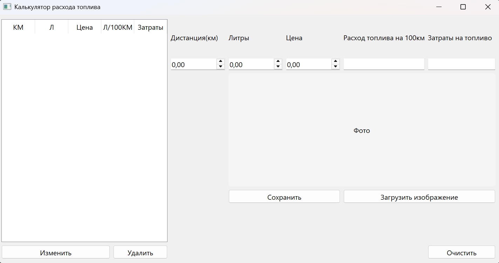

# Калькулятор расхода топлива

Приложение на PyQt5 для учёта поездок: пользователь вводит дистанцию, 
объём заправленного топлива и цену за литр, приложение автоматически считает 
расход на 100 км и стоимость поездки, сохраняет записи в локальную базу данных 
SQLite и позволяет прикреплять фотографию (например, чек или фото авто).

## Возможности

- Добавление, редактирование и удаление записей о поездках (CRUD)
- Автоматический расчёт расхода топлива (л/100км) и затрат (руб.)
- Хранение истории поездок в базе данных SQLite (`history_of_drives.db`)
- Загрузка и отображение изображения к записи с масштабированием через Pillow
- Валидация обязательных полей перед сохранением
- Подтверждение сохранения/выхода при закрытии окна (`closeEvent`)
- Логирование действий приложения (`app.log`)

## Установка и запуск

1. Клонируйте репозиторий:
   скачайте или клонируйте репозиторий:
   ```
   git clone <ссылка на репозиторий>
   cd <папка проекта>
   
   ```

2. Создайте и активируйте виртуальное окружение:
   ```
   python -m venv venv
   ```
   - Windows: venv\Scripts\activate
   - macOS/Linux: source venv/bin/activate

3. Установите зависимости:
   ```
   pip install -r requirements.txt
   ```

4. Запустите приложение:
   ```
   python main.py
   ```

При первом запуске автоматически создаётся файл базы данных `history_of_drives.db` 
с таблицей `items`.

Как должно выглядеть:



## Использование

1. Введите значения в поля **Дистанция(км)** и **Литры** — они обязательны для заполнения.
2. При необходимости укажите **Цену** за литр топлива.
3. Расход (л/100км) и затраты (руб.) рассчитываются автоматически и отображаются 
   в соответствующих полях.
4. При необходимости нажмите **«Загрузить изображение»**, чтобы прикрепить фото к записи.
5. Нажмите **«Сохранить»**, чтобы добавить новую запись в базу данных.
6. Чтобы отредактировать запись — выберите строку в таблице, измените значения 
   и нажмите **«Изменить»**.
7. Чтобы удалить запись — выберите строку и нажмите **«Удалить»**, подтвердив действие.
8. Кнопка **«Очистить»** сбрасывает все поля формы.
9. При закрытии окна приложение предложит сохранить несохранённые данные.

## Структура проекта

```
project/
├── main.py          # Точка входа, класс MyWin (QMainWindow), бизнес-логика
├── ui_main.py        # Интерфейс, сгенерированный из Qt Designer (Ui_MainWindow)
├── database.py        # Слой работы с данными (SQLite, CRUD)
├── requirements.txt     # Зависимости проекта
├── .gitignore         # Исключения для Git
├── history_of_drives.db   # Файл базы данных (создаётся автоматически)
├── app.log           # Лог-файл приложения (создаётся автоматически)
└── README.md
```
## Стек технологий

- Python 3
- PyQt5 — графический интерфейс (сигналы/слоты, менеджеры компоновки)
- SQLite (`sqlite3`) — хранение данных
- Pillow — обработка и масштабирование изображений
- logging — журналирование событий приложения

## Логирование

Все ключевые действия (инициализация БД, добавление/изменение/удаление записей, 
загрузка изображений, закрытие приложения, ошибки) записываются в файл `app.log` 
и выводятся в консоль.

## Автор

Воробьев Константин Евгеньевич

## Лицензия

Проект, выполнен в рамках учебной вычислительной практики.
